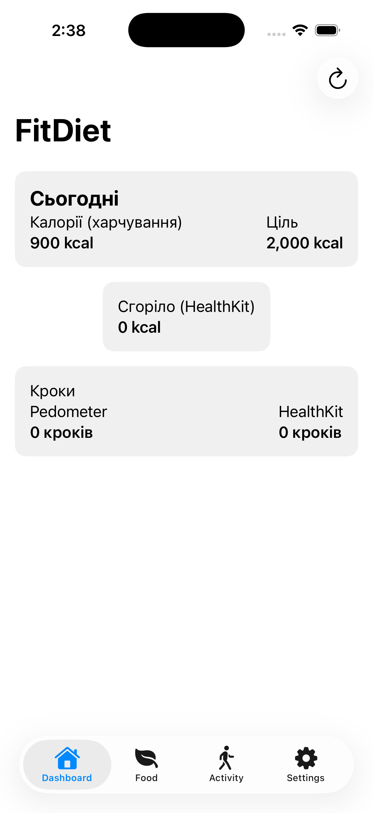
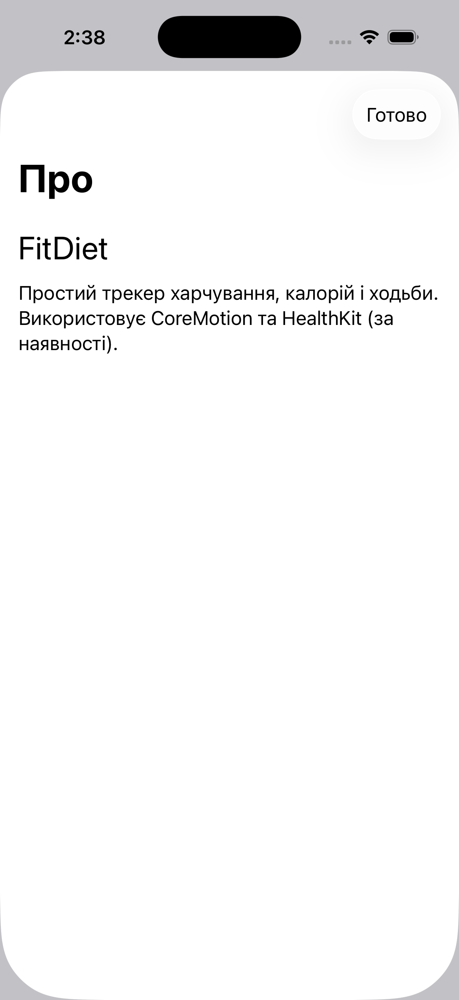
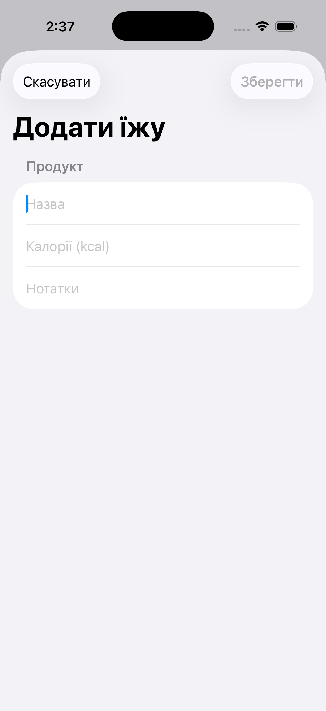
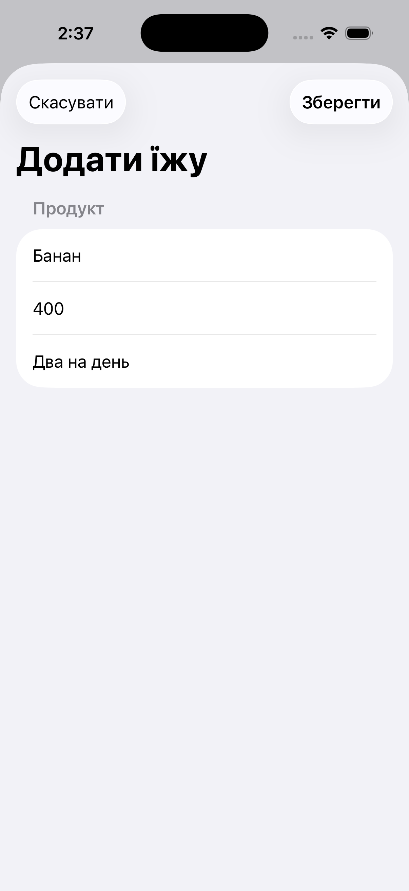
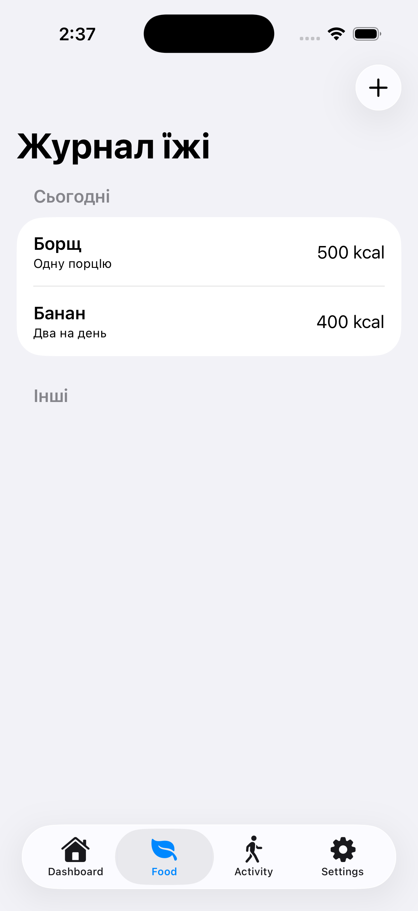
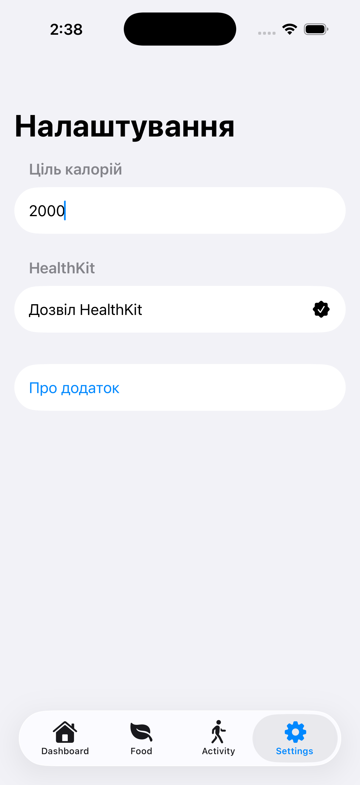

# HealthApp

# 🩺 HealthApp / HealthApp

**HealthApp** — мобільний застосунок для контролю здоров’я, харчування та активності.  
**HealthApp** is a mobile app for tracking health, nutrition, and physical activity.

---

## 📱 Основні функції / Features

- Підрахунок калорій із харчового щоденника / Track daily calories  
- Відстеження активності через HealthKit / Track activity via HealthKit  
- Збереження історії харчування / Save food log history  
- Підрахунок кроків у реальному часі / Real-time step counting  

---

## 📸 Скриншоти / Screenshots

 

---

## ⚙️ Технології / Technologies

- **SwiftUI**  
- **Combine**  
- **HealthKit**  
- **CoreData**  

---

## 🔐 Права доступу / Permissions

Застосунок запитує дозволи / The app requests permissions:

- `NSMotionUsageDescription` — для підрахунку кроків / For step counting  
- `NSHealthShareUsageDescription` — читання даних HealthKit / Read HealthKit data  
- `NSHealthUpdateUsageDescription` — запис даних HealthKit / Write HealthKit data  

---

## 🚀 Як запустити / How to run

1. Відкрити проєкт у **Xcode** / Open project in **Xcode**  
2. Увімкнути Capability → *HealthKit* / Enable Capability → *HealthKit*  
3. Зібрати та запустити на iPhone / Build and run on iPhone  
   *(Simulator не підтримує HealthKit / Simulator does not support HealthKit)*

---

## 👨‍💻 Автор / Author

**Danyil Klymchuk**  
📧 dannyk00222@gmail.com  
🌐 [GitHub](https://github.com/dannyk00222-alt)
